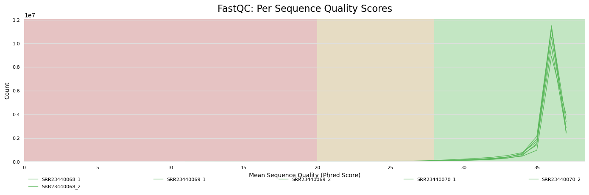
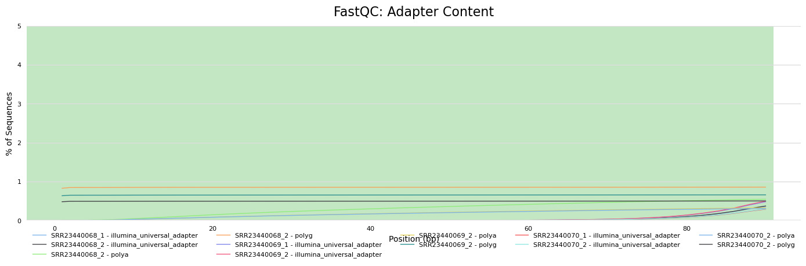
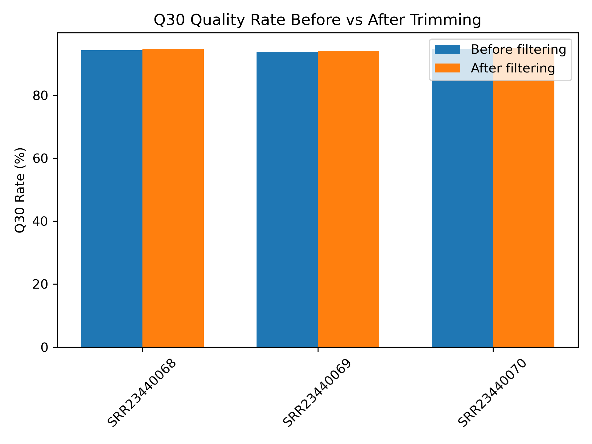
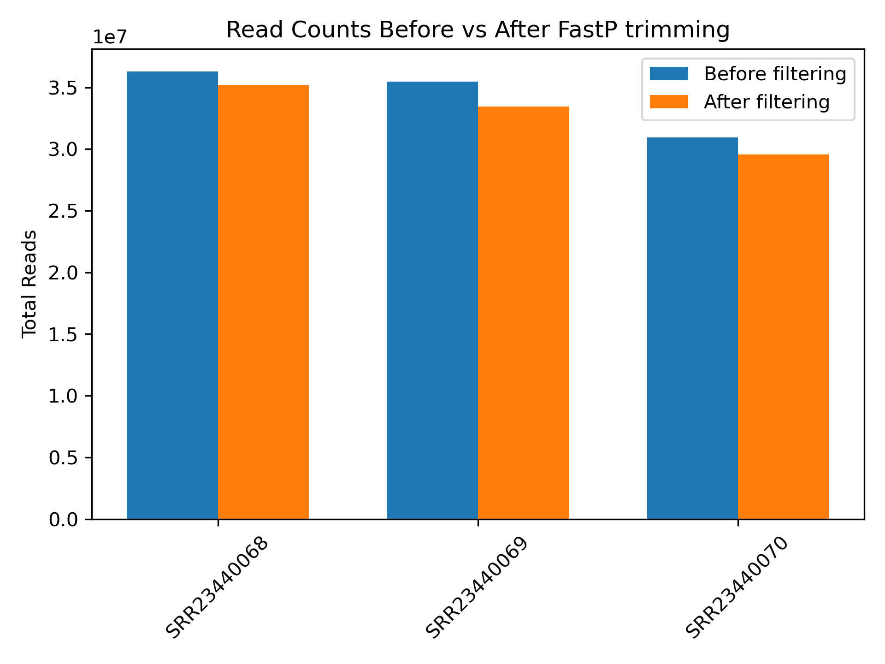
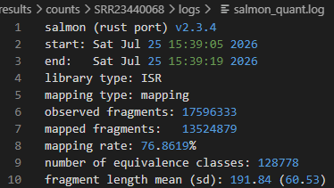
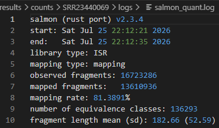
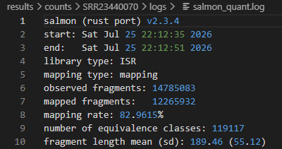
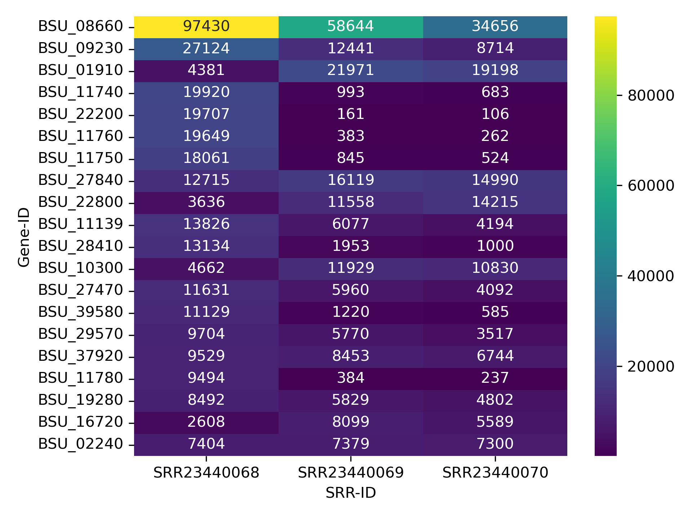

# Group Project: RNA-Seq Workflow (Microbial)

## Preparation
- GitHub Setup
-- Team Members: Shayda Arbabshirani, Clay Clarkson, Andrew Dahik
  
- **Manual Installation Tools**
   - Manual installation without dependency management is available by executing the /installation/manual_install.bash
 
- **Dependency Management**
    - A Conda environment was developed for managing dependencies and then containerized using Docker and called using Singularity.
    - Conda was installed using the following command
    ```bash
    wget https://repo.anaconda.com/miniconda/Miniconda3-latest-Linux-x86_64.sh -O /tmp/miniconda.sh
    ```
    - Following installation of Conda, all other tools were installed into an environment named 'groupone'
    - Additional features, such as containerization with Docker and Singularity were also experimented with and can be implemented.
      
- **Optional Tools Used for Dependency Management**
    - conda (version: 26.3.2)
    - Singularity (version: 3.8.6)
      
- **Steps for calling the script**
  ```bash
  cd groupone
  bash rnaseq <file_name> <optional output directory name>
  ```
  *Default directory name for output is the name of the file provided concatenated to the date in YYYYMMDD format*
## Data Retrieval
- **NCBI SRA Accessions Used:**
    - SRR23440068
    - SRR23440069
    - SRR23440070

- **Tools Used to Download Data:**
    - sra-tools (version: 3.4.1)

- **Tasks Performed:**
    - Extracted three SRA reads from https://www.ncbi.nlm.nih.gov/sra/?term=PRJNA934277
    - SRA reads are the first three time point samples used in transcriptome analysis by Jun et al. (2023)

- **Commands used to download data:**
    ```bash
    prefetch SRRXXXXXXX
    fasterq-dump SRRXXXXXXX -O data/raw
    ```

## Quality Control (QC)
- **Tools Used:**
    - FastQC (version: v0.12.1)
    - MultiQC (version: 1.19)

- **Command used to run quality tools:**
    ```bash
    fastqc "${RAW_DATA}/${SRA}_1.fastq" "${RAW_DATA}/${SRA}_2.fastq" \
            -o "$PROJ_DIR/results/qc" -t $THREAD_COUNT
    
    multiqc $PROJ_DIR/results/trimmed/ -o $PROJ_DIR/results/multiqc/posttrim --export
    ```
- **Tasks Performed:**
    - Generated per-sample QC reports found in results/qc/<SRA>/
    - Exported all figures generated by MultiQC into figures/pre_multiqc_plots
    - Summarized total reads read quality, GC content and duplication that can be found as results/total_seqs_qc_summary_table.csv
    - Summarized total reads and percent duplication for generating a table in the final report as results/total_seqs_duplicates_table.csv
- **Deliverables:**
     
    *Figure 1: Quality Scores Shown Before Read-Adapter Trimming*

     
    *Figure 2: Total Adapter Contamination, Before Read-Adapter Trimming*

    | Sample      |   total_sequences |   percent_duplicates |   percent_gc |   read_quality |
    |:------------|------------------:|---------------------:|-------------:|---------------:|
    | SRR23440068 |       3.63073e+07 |              86.7051 |           45 |             85 |
    | SRR23440069 |       3.5457e+07  |              86.8158 |           46 |             80 |
    | SRR23440070 |       3.09613e+07 |              85.5396 |           46 |             85 |

    *Table 1: Tabel of raw read counts (total_sequences), percent duplicates, percent gc, and average read quality for mate pairs*

- **Interpretation:**
    - Based on raw FastQC results above, the microbial sample assembly reached a threshold of adapter 
      content and read duplication that requires additional processing steps such as read adapter 
      trimming with tools like FastP. 

## Read Cleaning
- **Tools Used:**
    - FastP (version: 0.22.0)
- **Tasks Performed:**
    - Performed Read-Adapter trimming of all SRA samples used in this project.
    - Generated figures using a Python script embedded in the main script.
    - Generated a table of total reads before and after alongside figures.
- **Deliverables:**
    
    *Figure3: Generated Table of Phred Q30 Scores Before and After Fastp Trimming*

    
    *Figure4: Sequence Reads Before and After Trimming For Comparison Alongside Figure 3*

    | sample      |   total_reads_before |   total_reads_after | 
    |:------------|---------------------:|--------------------:|
    | SRR23440068 |             36307262 |            35192666 |
    | SRR23440069 |             35456960 |            33446572 |
    | SRR23440070 |             30961300 |            29570166 |
    *Table2: Table Representation of Figure 4 With Total Reads Before and After FastP Trimming.*
    *Additional Information is stored in fastqc_fastp_comparsion.csv, generated by 02_get_multiqc_graphs.py* 

- **Interpretation:**
    - Read-Adapter trimming demonstrated a reduction of duplicate reads and removal of adapater contanimants.
      This is Supported by Figures 3 and 4 showing a decrease in Read Counts, while Phred Q30 Qualtiy Scores
      remaind consistent as shown in Figure 3. An additional consideration was made for Subsequent cleaning operations
      to remove exogenous non-coding sequences, tRNA and rRNA that were identified. For this operation, 
      SortMeRNA were utilized momentarily, but was abandoned as it was too computationally expensive to merit including.  


## Alignment and Quantification
- **Tools Used:**
    - Salmon (version: 0.13.2)
    - gffread (version: 0.12.7)
- **Tasks Performed:**
    - Downloaded Reference Genome for B. subtilis from the NCBI at https://www.ncbi.nlm.nih.gov/datasets/genome/GCF_000009045.1/
    - Used Salmon to index the downloaded reference genome from above, align trimmed reads and quantify mapped reads.
- **Deliverables:**
    
    
    
    *Figures 5-7: Examples of log metrics of mapping procedures performed by Salmon for the three samples.*
- **Interpretation:**
    - Indexing and alignment using Salmon (Patro et al, 2017) were straightforward, generating very fast mapping results 
      as shown by the logs for each SRA sample in Figures 5-7. This lightweight tool was deliberated amongst the group,
      comparing it to other mapping and alignment tools like minimap2. It was ultimately decided by the group to utilize 
      Salmon given its mapping speed and output files did not require extensive postprocessing editing steps or additional
      tools like Samtools to produce mapping and quantification results.  

## Data Visualization
- **Tools Used:**
    - Python (version: 3.11.9)
    - Seaborn (version: 0.13.2)
    - Pandas (version: 3.0.3)
    - Matpltlib (version: 3.10.1)
    - Tabulate (version: 0.10.0)
- **Tasks Performed:**
    - Extracted the top 20 expressed genes across all three samples.
    - Extracted gene names from corresponding NCBI identification values (i.e. BSU-xxxxx) of the top 20 expressed genes.
    - Placed extracted top 20 expressed genes by BSU-xxxxx and corresponding gene name into the file topgenes_aggregate_20_reference.txt.
    - Created data frames using Pandas to organize data efficiently and Seaborn to visualize data in a heatmap figure for top 20 expressed genes.
    - Used MatPltLib.pyplot to plot all figures generated.
- **Deliverables:**
    
    *Figure8: Heatmap of top 20 genes based on read count quantification by Salmon*

- **Interpretation:**
    - While the following major tools used throughout this workflow were indispensible for performing niche assignments 
      to produced gene expression counts, further downstream analysis of these counts were necessary for visualization. 
      Throughout the workflow, certain visualization milestones were gathered using embedded Python scripts 
      between intermediary steps before and after expression quanitfication. Coding architecture was designed to handle
      the data inputs heuristically with some consideration given to runtime performance. 
    - From the heatmap generated from Figure 8, the first time point sample has very noticeable expression of the 
      small acid-soluble spore protein (gamma-type SASP). SASP has high expression at the first time sample (SRR2340068), which was 
      recorded by Jun et al. (2023) at an 8 hour time point, when the B. subtilis begun exponential growth. Based on the
      decline in SASP over the next two time samples which occured at hour 10 (end of exponential growth as noted by the authors) and
      hour 12 (the beginning of sporulation).
    - Additional findings concur relatively with the findings by Jun et al. (2023, Table 1) with additional coating proteins being 
      identified following this replication. Compared to the findings by the authors, the heatmap has different values which can
      be explained by the use of different alignment and quantification tools, with the authors using HTseq 0.10.0 and Bowtie 1.1.2

## Conclusion
- For future revisions to this project, direct recreation of the authors findings using exact tools and versions may be insightful 
  for replications. While this project uses only three inputs from sra.txt, the main bash script (groupone/main.bash) is modularized
  to handle non-flagged one system argument, which would be for files containing SRAs that are to be processed. 
- With regards to data storage and clean up operations, for this project the data generated (excluding temporary files) were kept
  for access. In the future, data and results directories may be removed for cleanup procedures while preserving the files of interest that
  were generated. The output files that are generated can be found in the output directory residing outside of groupone. 

## References
- Andrews, S (2023). FastQC: A quality control analysis tool for high throughput sequencing data. Retrieved from https://github.com/s-andrews/FastQC
- Chen, S. (2025) fastp 1.0: An ultra-fast all-round tool for FASTQ data quality control and preprocessing. iMeta 2025: https://doi.org/10.1002/imt2.107. Retrieved from https://github.com/OpenGene/fastp
- Ewels, P. (2026). MultiQC: Aggregate results from bioinformatics analyses across many samples into a single report. Retrieved from https://github.com/MultiQC/MultiQC
- Jun, J. S., Jeong, H. E., Moon, S. Y., Shin, S. H., & Hong, K. W. (2023). Time-Course Transcriptome Analysis of Bacillus subtilis DB104 during Growth. Microorganisms, 11(8), 1928. https://doi.org/10.3390/microorganisms11081928. 
- Patro, R., Duggal, G., Love, M. I., Irizarry, R. A., & Kingsford, C. (2017). Salmon provides fast and bias-aware quantification of transcript expression. Nature Methods. https://www.biorxiv.org/content/10.1101/021592v3.full. Retrieved from https://github.com/COMBINE-lab/salmon 
